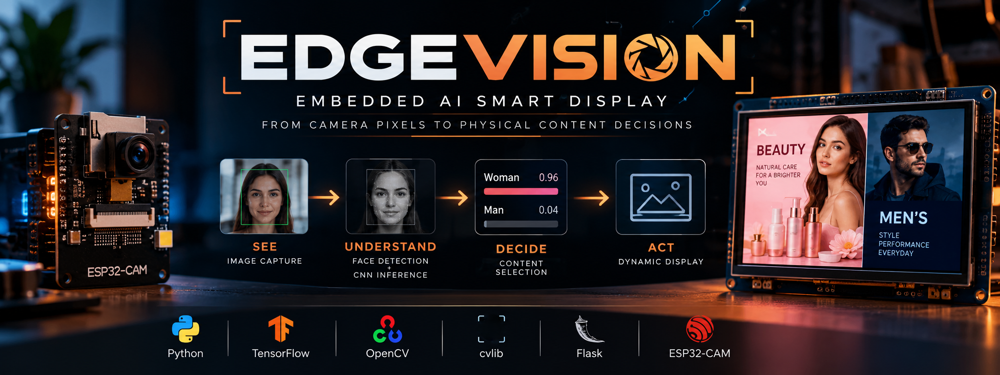
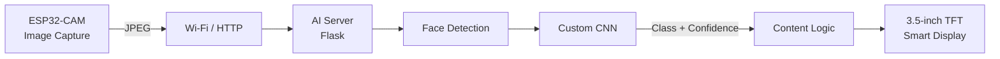

<p align="center">
  
</p>

<p align="center">
  <b>Computer Vision • Embedded Systems • Edge AI • Smart Display</b>
</p>

<p align="center">
  From camera pixels to physical content decisions.
</p>


### Embedded AI Smart Display

**Computer Vision • TensorFlow • Flask • ESP32-CAM • Smart Display**

EdgeVision is an embedded-AI prototype that connects real-time visual classification to a physical display system.

The project combines a custom CNN, face detection, an HTTP inference server, and a proposed ESP32-CAM + TFT architecture to dynamically select displayed content.

---

## How It Works



The AI server currently works with local image requests and webcam inference.  
The ESP32-CAM + TFT section represents the target embedded architecture.

---

## AI Pipeline


The model was built from scratch with TensorFlow/Keras and trained on two visual categories used by the prototype.

### Model Overview

| Parameter | Value |
|---|---|
| Input | 96 × 96 × 3 |
| Framework | TensorFlow / Keras |
| Architecture | Custom CNN |
| Epochs | 100 |
| Batch size | 64 |
| Optimizer | Adam |
| Face Detection | cvlib + OpenCV |

---

## Training Results

<p align="center">
  
</p>

The model reaches high training and validation accuracy, while the validation-loss curve shows occasional confidence spikes that deserve deeper evaluation.

---

## Inference Modes

### Local Webcam


Implemented in:

[`model/webcam_inference.py`](model/webcam_inference.py)

---

### HTTP AI Server


Implemented in:

[`model/server_inference.py`](model/server_inference.py)

Example response:

```json
{
  "label": "woman",
  "confidence": 0.9632,
  "confidence_percent": 96.32
}
```

---

## Hardware Concept

The proposed embedded side uses:

| Component | Role |
|---|---|
| ESP32-CAM | Image acquisition + Wi-Fi |
| 3.5-inch ILI9486 TFT | Dynamic content display |
| AI Server | Face detection + CNN inference |

More details:

[Hardware Architecture →](hardware/)

---


## Why EdgeVision?

The goal is not only to classify an image.


EdgeVision explores how computer vision can become part of a complete embedded system where AI results influence real-world hardware behavior.

---

## Limitations

The classifier operates only on the visual categories represented in its training dataset.

It should not be interpreted as determining a person's actual gender identity.

Predictions may also be affected by lighting, pose, image quality, occlusion and dataset bias.

---

## Tech Stack

`Python` · `TensorFlow` · `Keras` · `OpenCV` · `cvlib` · `Flask` · `ESP32-CAM`

---

## Author

**Med Reda**

Embedded Systems • PCB Design • Control • Robotics • Edge AI
