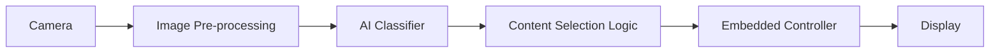

# EdgeVision Ads

### Embedded AI Smart Display

**Camera • Edge AI • Audience Classification • Embedded Control • Dynamic Content Display**

EdgeVision Ads is an embedded AI prototype that uses a camera-based classifier to select display content dynamically.

The project is designed as an end-to-end system rather than only an AI notebook: image acquisition, inference, decision logic, embedded control, and display output are treated as parts of one complete product.

> **Important:** the visual classifier should be described using the labels it was actually trained on. It does not determine a person's identity or definitive gender. Classification results can be wrong, and the system should not be used for consequential decisions.

---

## System Architecture



A possible hardware implementation is:

```text
Camera / Vision Module
        │
        ▼
AI Inference
        │
        ▼
Embedded Controller
        │
        ▼
Content Selection
        │
        ▼
LCD / Display
```

---

## Project Goals

- Build a real-time visual classification pipeline.
- Run inference locally when possible.
- Connect AI decisions to an embedded hardware output.
- Display different content according to the classifier output.
- Keep the architecture modular so the classifier can later be replaced by another audience-aware or context-aware model.
- Document accuracy, failure cases, privacy constraints, and hardware behavior.

---

## Repository Structure

```text
EdgeVision-Ads/
│
├── README.md
├── .gitignore
├── requirements.txt
│
├── model/
│   ├── README.md
│   ├── train.py
│   ├── infer.py
│   └── config.example.json
│
├── embedded/
│   ├── README.md
│   └── firmware/
│       └── README.md
│
├── hardware/
│   ├── README.md
│   ├── system_architecture.md
│   └── bom.csv
│
├── demo/
│   ├── README.md
│   └── content_map.example.json
│
├── docs/
│   ├── model_card.md
│   ├── privacy_and_limitations.md
│   └── validation_plan.md
│
├── data/
│   └── README.md
│
└── assets/
    ├── README.md
    ├── architecture/
    ├── demo/
    └── hardware/
```

---

## AI Pipeline

```text
Frame Capture
    ↓
Face / Region Detection
    ↓
Resize + Normalize
    ↓
Classifier
    ↓
Predicted Class + Confidence
    ↓
Decision Threshold
    ↓
Content ID
```

The exact preprocessing steps, model architecture, labels, and confidence threshold should match the implementation used in `model/`.

---

## Embedded Flow

```text
AI Result
   ↓
Content ID
   ↓
MCU / Embedded Controller
   ↓
Display Driver
   ↓
Selected Advertisement / Content
```

The communication interface between the inference side and the embedded controller can be implemented using UART, USB CDC, SPI, Wi-Fi, or another interface depending on the final hardware.

---

## Current Status

Update this table as the project evolves.

| Stage | Status |
|---|---|
| Dataset preparation | ⬜ |
| Model training | ⬜ |
| Offline inference | ⬜ |
| Camera integration | ⬜ |
| Embedded communication | ⬜ |
| Display integration | ⬜ |
| End-to-end demo | ⬜ |
| Accuracy evaluation | ⬜ |
| Privacy review | ⬜ |

---

## Demo

Place screenshots, GIFs, and short demo media inside:

```text
assets/demo/
```

Recommended final demo sequence:

```text
Camera sees subject
        ↓
Model produces class + confidence
        ↓
System selects content
        ↓
Display changes
```

---

## Hardware

Hardware documentation lives in [`hardware/`](hardware/).

Recommended items to document:

- camera / vision module,
- embedded controller,
- display,
- power supply,
- communication interface,
- wiring or custom PCB,
- final physical setup.

---

## Model

Model documentation and scripts live in [`model/`](model/).

The repository should eventually include:

- training script,
- inference script,
- preprocessing definition,
- model format,
- class labels,
- evaluation metrics,
- representative failure cases.

Avoid committing large datasets or large trained-model files directly to Git unless necessary.

---

## Privacy & Limitations

This project should be treated as an engineering prototype.

The classifier can make incorrect predictions and should not be presented as determining a person's actual gender or identity. The README and demo should clearly describe the model's training labels and limitations.

When possible:

- process images locally,
- avoid storing camera frames,
- avoid identity recognition,
- avoid using the output for consequential decisions,
- document uncertainty and confidence thresholds.

See [`docs/privacy_and_limitations.md`](docs/privacy_and_limitations.md).

---

## Tools

Fill this section with the tools actually used.

| Area | Tool |
|---|---|
| AI Framework | TODO |
| Computer Vision | TODO |
| MCU / Embedded Platform | TODO |
| Firmware IDE | TODO |
| Display | TODO |
| Version Control | Git + GitHub |

---

## Future Improvements

- Replace the initial classifier with a more robust context-aware model.
- Add occupancy / people counting.
- Add time-of-day or environment-aware content selection.
- Optimize inference for edge hardware.
- Add confidence-based fallback content.
- Add a local dashboard for system statistics without storing raw images.

---

## Author

**Med Reda**

Embedded Systems • PCB Design • Control • Robotics • Edge AI
