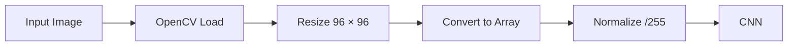

# Dataset

The EdgeVision classifier was trained on a face-image dataset organized into two visual categories used by the prototype.

## Dataset Structure

```text
gender_dataset_face/
├── man/
│   ├── image_001.jpg
│   ├── image_002.jpg
│   └── ...
│
└── woman/
    ├── image_001.jpg
    ├── image_002.jpg
    └── ...
```

---

## Preprocessing

Before training, each image is processed as follows:



Images are loaded using OpenCV and therefore use **BGR channel ordering**.

---

## Dataset Split

The dataset is divided into:

| Split | Ratio |
|---|---:|
| Training | 80% |
| Validation | 20% |

The split uses a fixed random seed for reproducibility.

---

## Data Augmentation

Training images are augmented dynamically using:

- rotation,
- horizontal and vertical shifts,
- shear,
- zoom,
- horizontal flipping.

This increases image variability without duplicating files on disk.

---

## Local Dataset Location

The full dataset is intentionally not included in the repository.

Expected local path:

```text
data/gender_dataset_face/
```

The training script automatically reads the dataset from this directory.

---

## Sample Images

A small set of representative images may be stored in:

```text
data/samples/
```

These samples are intended only to illustrate the dataset structure and should only be included when their license permits redistribution.

---

## Dataset Notes

The dataset may contain biases related to lighting, pose, image quality, demographics, and class distribution.

These limitations can affect model performance and should be considered when interpreting classification results.
