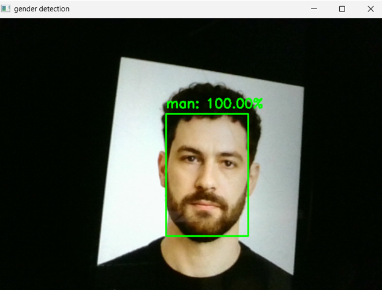

# Demo

This folder contains a simple validation of the **local webcam inference pipeline**.

The test was performed using:

```text
model/webcam_inference.py
```

The script captures frames from the PC webcam, detects a face, preprocesses the detected region, runs CNN inference, and overlays the predicted class with its confidence score.

---

## Demo Flow


---

## Result

<p align="center">
  
</p>

The screenshot above shows a successful real-time test of the webcam inference pipeline, including:

- face detection,
- bounding-box visualization,
- model inference,
- confidence display.

---

## Purpose

This demo validates the vision pipeline independently from the final ESP32-CAM hardware architecture.

It confirms that the trained model can be used in real time before integrating network communication and the smart-display system.

---

## Run the Demo

From the repository root:

```bash
python model/webcam_inference.py
```

Press:

```text
Q
```

to stop the webcam application.
