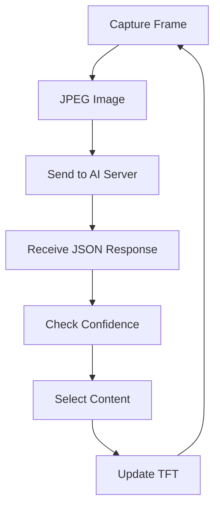
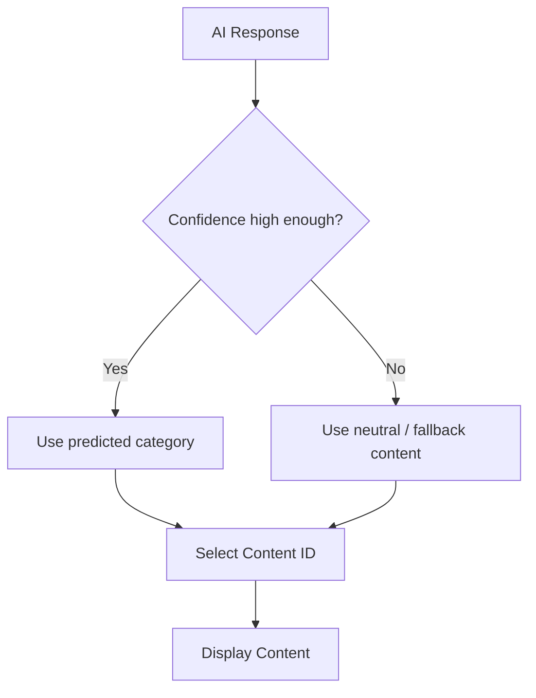
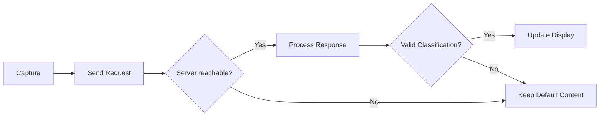

# Embedded System

The embedded side of **EdgeVision** is built around the **ESP32-CAM**.

It acts as the bridge between the physical world and the AI server:

- captures images,
- compresses them as JPEG,
- sends them over Wi-Fi,
- receives the AI result,
- selects the corresponding content,
- updates the display.

---

## Embedded Flow



---

## Communication

The ESP32-CAM sends the captured image to:

```text
POST /predict
```

using:

```text
Content-Type: image/jpeg
```

The AI server returns a JSON response such as:

```json
{
  "label": "woman",
  "confidence": 0.9632,
  "confidence_percent": 96.32
}
```

---

## Decision Logic



A confidence threshold should be used so that uncertain predictions do not automatically change the displayed content.

---

## Firmware Responsibilities

The firmware is responsible for:

| Function | Role |
|---|---|
| Camera | Capture frames |
| JPEG | Prepare image for transmission |
| Wi-Fi | Connect to the local network |
| HTTP Client | Send images to the AI server |
| JSON Parser | Read classification results |
| Decision Logic | Select appropriate content |
| TFT Driver | Update the display |
| Error Handling | Manage server/network failures |

---

## Firmware Structure

```text
embedded/
│
├── README.md
│
└── firmware/
    ├── README.md
    ├── camera/
    ├── network/
    ├── display/
    └── application/
```

The exact implementation may be organized differently depending on the final ESP32 framework used.

---

## Error Handling

The embedded system should handle cases such as:



This prevents the display from depending completely on a successful AI prediction.

---

## Embedded Design Principle


The ESP32-CAM handles the real-time embedded behavior while the heavier AI computation remains on the external inference server.
