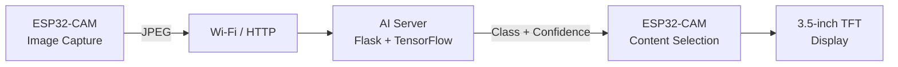
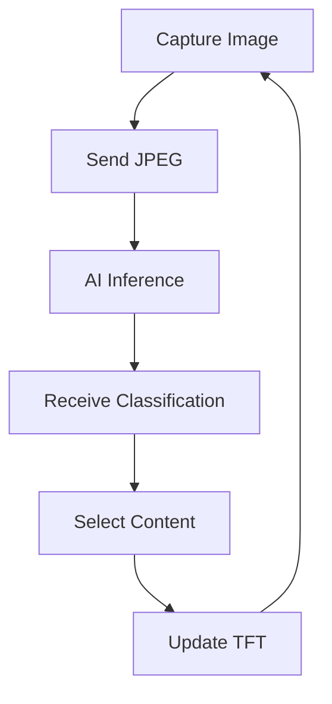
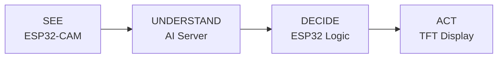

# Hardware

The hardware side of **EdgeVision** is intentionally compact.

An **ESP32-CAM** handles image acquisition, Wi-Fi communication and display control, while a **3.5-inch TFT** presents the dynamically selected content.

---

## Hardware Architecture



---

## Hardware Roles

| Hardware | Role |
|---|---|
| **ESP32-CAM** | Image capture, JPEG transmission, Wi-Fi communication and embedded control |
| **3.5-inch TFT** | Displays the selected advertisement or visual content |
| **AI Server** | Runs face detection and CNN inference |

---

## System Flow



The ESP32-CAM remains lightweight: it captures images and controls the physical interface, while the computationally expensive neural-network inference is executed remotely.

---

## Communication

### ESP32-CAM → AI Server

```text
HTTP POST /predict
Content-Type: image/jpeg
```

The camera frame is compressed as JPEG and sent over Wi-Fi.

### AI Server → ESP32-CAM

Example response:

```json
{
  "label": "woman",
  "confidence": 0.9632,
  "confidence_percent": 96.32
}
```

The ESP32-CAM uses the returned result to determine which content should be shown on the TFT.

---

## Hardware Files

```text
hardware/
├── README.md
├── system_architecture.md
├── wiring.md
└── bom.csv
```

---

## Design Idea



EdgeVision connects computer vision to a physical output rather than stopping at an AI prediction.
