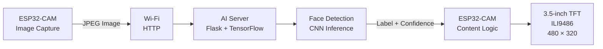
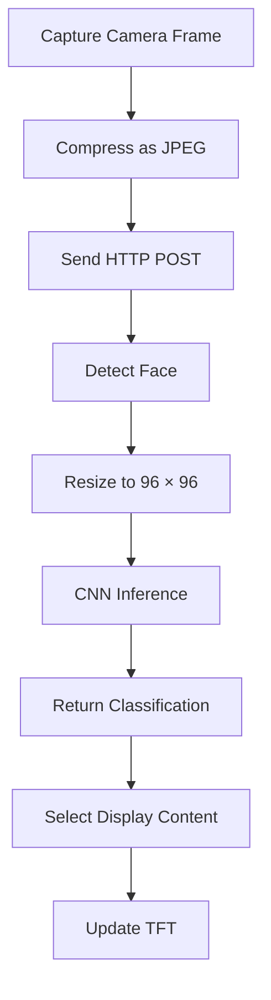
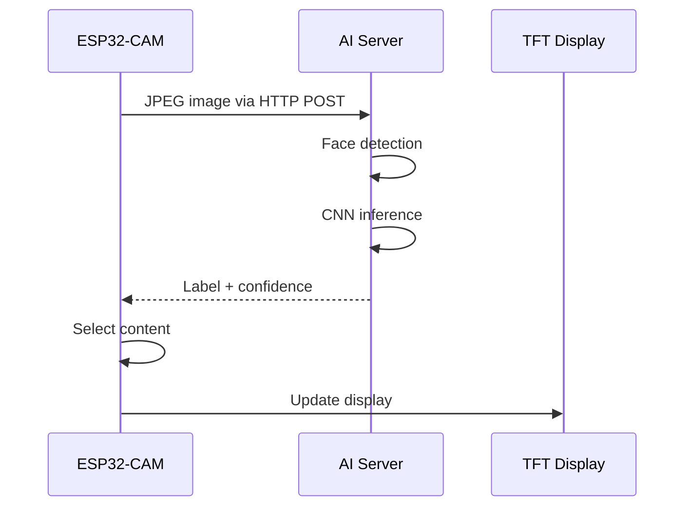
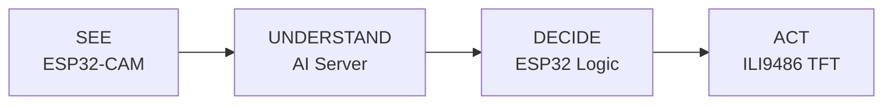

# System Architecture

EdgeVision is split into two main parts:

- the **embedded side**, based on the ESP32-CAM and TFT display,
- the **AI side**, running face detection and CNN inference on a separate machine.

---

## High-Level Architecture



---

## System Flow



---

## Embedded Side

The **ESP32-CAM** is responsible for:

- image acquisition,
- JPEG generation,
- Wi-Fi communication,
- sending images to the AI server,
- receiving the classification result,
- selecting the corresponding content,
- controlling the display.

---

## AI Side

The AI server is responsible for:


The inference server exposes:

```text
POST /predict
```

Example response:

```json
{
  "label": "woman",
  "confidence": 0.9632,
  "confidence_percent": 96.32
}
```

---

## Display

The display used in the prototype is:

| Property | Value |
|---|---|
| Size | 3.5 inch |
| Resolution | 480 × 320 |
| Controller | ILI9486 |
| Interface | 16-bit parallel |
| Supply | 3.3 – 5.5 V |
| Touch | Yes |

The TFT displays the content selected after the AI result is received.

---

## Communication Architecture



---

## Design Separation



The main design idea is to keep the embedded hardware lightweight while moving the computationally expensive neural-network inference to a more capable machine.

---

## Hardware Constraint

The ESP32-CAM already uses many GPIO pins for the camera interface.

The selected ILI9486 display uses a **16-bit parallel bus**, which also requires a large number of GPIOs.

For this reason, the final ESP32-CAM ↔ TFT pin mapping should only be documented after the interface has been physically validated.
