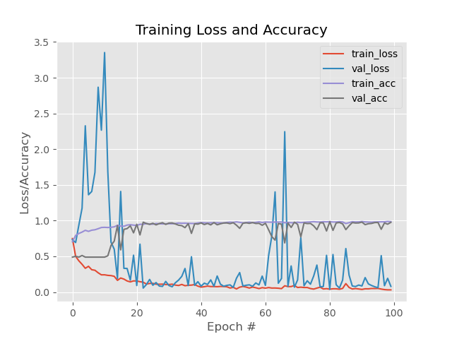

# EdgeVision — AI Model

The vision layer of **EdgeVision** is based on a custom convolutional neural network built with TensorFlow/Keras.

The model receives a detected face, preprocesses it into a `96 × 96` image, and classifies it into one of the two visual categories used by the prototype.

The model is only one part of the complete system:

```text
Camera
   ↓
Face Detection
   ↓
Image Preprocessing
   ↓
CNN Inference
   ↓
Class + Confidence
   ↓
Content Selection
   ↓
Smart Display
```

---

## Model Folder

```text
model/
│
├── README.md
│
├── train.py
│
├── webcam_inference.py
│
├── server_inference.py
│
└── training_plot.png
```

### Files

| File | Purpose |
|---|---|
| `train.py` | Loads the dataset, trains the CNN and exports the trained model |
| `webcam_inference.py` | Runs face detection and classification using the PC webcam |
| `server_inference.py` | Exposes the model through a Flask HTTP API for the embedded system |
| `training_plot.png` | Training / validation accuracy and loss |
| `README.md` | Model documentation |

---

# 1. Input Pipeline

The CNN does not receive the complete camera frame directly.

A face is first detected and extracted from the image.

```text
Original Image
      ↓
Face Detection
      ↓
 Face Bounding Box
      ↓
   Face Crop
      ↓
   Resize
   96 × 96
      ↓
  Normalize
  pixel / 255
      ↓
     CNN
```

The same preprocessing principle is used during local and server-side inference.

---

## Input Format

| Property | Value |
|---|---|
| Width | `96 px` |
| Height | `96 px` |
| Channels | `3` |
| Channel order | BGR |
| Data type | Float |
| Normalization | `pixel / 255.0` |
| Output classes | `2` |

The training images are loaded using OpenCV:

```python
image = cv2.imread(img)
```

Because OpenCV loads images using **BGR ordering**, inference also keeps the same BGR representation to remain consistent with training.

---

# 2. Class Mapping

The training code maps the dataset labels as follows:

```text
man   → 0
woman → 1
```

After one-hot encoding:

```text
man   → [1, 0]
woman → [0, 1]
```

The inference scripts therefore use:

```python
classes = ["man", "woman"]
```

and select the output with the highest confidence:

```python
idx = np.argmax(prediction)
label = classes[idx]
```

---

# 3. CNN Architecture

The classifier was built from scratch using TensorFlow/Keras rather than using a pretrained network.

```text
Input
96 × 96 × 3
      │
      ▼
┌─────────────────────┐
│ Conv2D — 32 filters │
│ ReLU                │
│ Batch Normalization │
│ MaxPooling 3 × 3    │
│ Dropout 0.25        │
└──────────┬──────────┘
           │
           ▼
┌─────────────────────┐
│ Conv2D — 64 filters │
│ ReLU                │
│ Batch Normalization │
│                     │
│ Conv2D — 64 filters │
│ ReLU                │
│ Batch Normalization │
│ MaxPooling 2 × 2    │
│ Dropout 0.25        │
└──────────┬──────────┘
           │
           ▼
┌──────────────────────┐
│ Conv2D — 128 filters │
│ ReLU                 │
│ Batch Normalization  │
│                      │
│ Conv2D — 128 filters │
│ ReLU                 │
│ Batch Normalization  │
│ MaxPooling 2 × 2     │
│ Dropout 0.25         │
└──────────┬───────────┘
           │
           ▼
        Flatten
           │
           ▼
┌─────────────────────┐
│ Dense — 1024        │
│ ReLU                │
│ Batch Normalization │
│ Dropout 0.50        │
└──────────┬──────────┘
           │
           ▼
       Dense — 2
           │
           ▼
        Sigmoid
           │
           ▼
   Classification
```

The convolutional stages progressively extract visual features while dropout and batch normalization are used to improve training stability and reduce overfitting.

---

# 4. Training Configuration

The current model was trained with the following configuration:

| Parameter | Value |
|---|---:|
| Epochs | `100` |
| Batch size | `64` |
| Learning rate | `1e-3` |
| Input size | `96 × 96 × 3` |
| Validation split | `20%` |
| Optimizer | Adam |
| Loss | Binary Cross-Entropy |
| Output activation | Sigmoid |

The dataset is randomly divided using:

```python
train_test_split(
    data,
    labels,
    test_size=0.2,
    random_state=42
)
```

---

# 5. Data Augmentation

To expose the model to more variation during training, image augmentation is applied dynamically.

```python
ImageDataGenerator(
    rotation_range=25,
    width_shift_range=0.1,
    height_shift_range=0.1,
    shear_range=0.2,
    zoom_range=0.2,
    horizontal_flip=True,
    fill_mode="nearest"
)
```

This introduces variation in:

```text
Rotation
Translation
Zoom
Shear
Horizontal orientation
```

without requiring additional stored images.

---

# 6. Training Results

<p align="center">
  
</p>

The graph shows the evolution of:

- training loss,
- validation loss,
- training accuracy,
- validation accuracy

over the 100 training epochs.

The model reaches high training and validation accuracy, although some validation-loss spikes can be observed.

These spikes may correspond to a small number of validation samples being classified incorrectly with high model confidence.

For this reason, accuracy alone should not be considered sufficient for evaluating the classifier.

Future evaluation can include:

```text
Confusion Matrix
Precision
Recall
F1 Score
Per-Class Accuracy
Confidence Distribution
```

---

# 7. Local Webcam Inference

[`webcam_inference.py`](webcam_inference.py) provides the simplest way to test the complete model locally.

The pipeline is:

```text
PC Webcam
    ↓
OpenCV Frame
    ↓
cvlib Face Detection
    ↓
Face Crop
    ↓
96 × 96 Resize
    ↓
Normalization
    ↓
CNN Inference
    ↓
Class + Confidence
    ↓
Result Overlay
```

The detected face is highlighted directly on the webcam stream.

Example:

```text
┌─────────────────────────┐
│                         │
│      ┌───────────┐      │
│      │   FACE    │      │
│      └───────────┘      │
│      woman: 96.3%       │
│                         │
└─────────────────────────┘
```

Run it with:

```bash
python webcam_inference.py
```

Press:

```text
Q
```

to stop the application.

---

# 8. Network / Embedded Inference

The final system does not depend on the PC webcam.

Instead, an embedded camera can capture an image and send it to the AI server.

[`server_inference.py`](server_inference.py) exposes the model through a Flask HTTP API.

```text
Embedded Camera
      │
      │ JPEG image
      │ HTTP POST
      ▼
┌──────────────────────┐
│ Flask AI Server      │
│                      │
│ JPEG Decode          │
│ Face Detection       │
│ Face Crop            │
│ Preprocessing        │
│ TensorFlow Inference │
└──────────┬───────────┘
           │
           │ JSON
           ▼
     Embedded System
```

---

## Prediction Endpoint

The server exposes:

```text
POST /predict
```

The embedded camera sends the raw JPEG image using:

```text
Content-Type: image/jpeg
```

The server then performs:

```text
JPEG Bytes
    ↓
cv2.imdecode()
    ↓
Face Detection
    ↓
Largest Face Selection
    ↓
Face Crop
    ↓
Resize 96 × 96
    ↓
Normalize /255
    ↓
CNN
    ↓
JSON Response
```

---

## Example Response

A successful prediction can return:

```json
{
    "label": "woman",
    "prob": 0.9632,
    "confidence_percent": 96.32
}
```

Here, `prob` should be interpreted as the model's **confidence score**, not necessarily as a statistically calibrated probability.

---

## No Face Detected

If no valid face is found:

```json
{
    "error": "no valid face detected"
}
```

---

## Invalid Image

If the JPEG cannot be decoded:

```json
{
    "error": "could not decode image"
}
```

---

# 9. Why Use a Server?

The trained TensorFlow model is significantly larger than what a small embedded camera/controller can conveniently execute.

Instead of forcing the entire neural network onto the embedded device, EdgeVision separates the system into two responsibilities.

### Embedded side

```text
Capture Image
     ↓
JPEG Compression
     ↓
Wi-Fi / Network
```

### AI side

```text
Receive JPEG
     ↓
Detect Face
     ↓
Run CNN
     ↓
Return Result
```

This architecture allows the embedded hardware to remain relatively lightweight while the computationally expensive inference runs on a more capable machine.

---

# 10. Model File

The trained network is currently exported as:

```text
gender_detection.model
```

The model is approximately **100 MB**, so it is intentionally not stored directly inside the normal Git repository.

The repository therefore contains the code required to train and use the network while the trained artifact can be distributed separately, for example through:

```text
GitHub Releases
Git LFS
External model storage
```

---

# 11. Dependencies

The AI pipeline uses:

```text
TensorFlow / Keras
OpenCV
NumPy
cvlib
scikit-learn
Matplotlib
Flask
```

A typical environment can be installed from the repository root with:

```bash
pip install -r requirements.txt
```

---

# 12. Dataset

The training dataset is intentionally not stored directly in this repository.

Expected local structure:

```text
data/
└── gender_dataset_face/
    ├── man/
    │   ├── image_001.jpg
    │   ├── image_002.jpg
    │   └── ...
    │
    └── woman/
        ├── image_001.jpg
        ├── image_002.jpg
        └── ...
```

`train.py` loads the folder name as the class label.

Dataset source, licensing information and final dataset statistics should be documented in the repository's [`data/`](../data/) section.

---

# 13. Training vs Inference Consistency

An important requirement of the project is keeping image preprocessing consistent.

### Training

```text
cv2.imread()
    ↓
BGR
    ↓
Resize 96 × 96
    ↓
/255
    ↓
CNN
```

### Webcam inference

```text
Camera
    ↓
BGR
    ↓
Face Detection
    ↓
Face Crop
    ↓
Resize 96 × 96
    ↓
/255
    ↓
CNN
```

### Server inference

```text
JPEG
    ↓
cv2.imdecode()
    ↓
BGR
    ↓
Face Detection
    ↓
Face Crop
    ↓
Resize 96 × 96
    ↓
/255
    ↓
CNN
```

This keeps the representation seen during inference consistent with what the network saw during training.

---

# 14. Current Limitations

The current model is an engineering prototype rather than a production classification system.

Its performance can be affected by:

- lighting conditions,
- camera resolution,
- viewing angle,
- face orientation,
- partial occlusion,
- distance from the camera,
- dataset imbalance,
- dataset bias,
- images unlike the training distribution.

The model can also produce highly confident incorrect classifications.

A confidence threshold and neutral fallback behavior should therefore be used in the complete display system.

---

## Classification Scope

The model predicts between the two visual categories present in its training dataset.

It should **not** be presented as determining a person's actual gender identity.

The classification component is used here to demonstrate the integration of:

```text
Computer Vision
      +
Deep Learning
      +
Networking
      +
Embedded Systems
      +
Dynamic Content Control
```

rather than for consequential identity-related decisions.

---

# 15. Future Improvements

Several improvements are possible.

### Model

- Replace the two-output sigmoid with a softmax classifier.
- Use categorical cross-entropy for mutually exclusive classes.
- Add a dedicated untouched test set.
- Use stratified dataset splitting.
- Generate a confusion matrix.
- Report precision, recall and F1 score.
- Investigate validation-loss spikes.
- Add confidence calibration.

### Model Size

The current architecture contains a relatively large:

```text
Flatten
   ↓
Dense 1024
```

stage.

A lighter architecture could replace this with:

```text
Global Average Pooling
```

or use a compact network designed for edge inference.

This could significantly reduce model size.

### Edge Deployment

Future versions could investigate:

```text
TensorFlow Lite
Quantization
Edge accelerators
More capable embedded Linux platforms
```

to move more inference directly onto the edge device.

---

# From Pixels to Decisions

The purpose of this model is not simply to classify an image.

It provides the perception layer of a larger embedded system:

```text
SEE
 │
 ▼
Camera

UNDERSTAND
 │
 ▼
CNN

DECIDE
 │
 ▼
Content Logic

ACT
 │
 ▼
Smart Display
```

That connection between **perception and physical system behavior** is the core idea behind EdgeVision.
