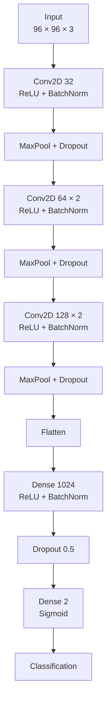
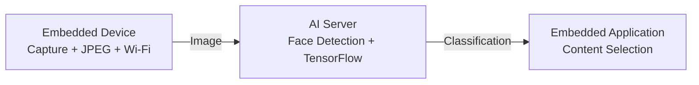
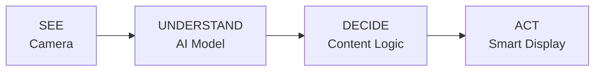

# AI Vision Model

The perception layer of **EdgeVision** uses a custom TensorFlow/Keras CNN to classify detected face images into the two visual categories used by the prototype.

The model works with `96 × 96` images and is shared by both the local webcam demo and the network inference server.

---

## Vision Pipeline


### Input

| Parameter | Value |
|---|---|
| Resolution | 96 × 96 |
| Channels | 3 |
| Color order | BGR |
| Normalization | `/255.0` |
| Classes | `man`, `woman` |

Training and inference use the same OpenCV-based preprocessing pipeline.

---

## CNN Architecture



---

## Training

| Parameter | Value |
|---|---:|
| Epochs | 100 |
| Batch size | 64 |
| Learning rate | 0.001 |
| Optimizer | Adam |
| Validation split | 20% |
| Loss | Binary Cross-Entropy |

Data augmentation includes rotation, translation, shear, zoom and horizontal flipping.

### Training Results

<p align="center">
  
</p>

The model reaches high training and validation accuracy, although the validation-loss curve contains occasional spikes that deserve further evaluation with metrics such as a confusion matrix, precision, recall and F1-score.

---

## Local Webcam Inference

[`webcam_inference.py`](webcam_inference.py)


This mode is mainly used for quick local testing of the complete vision pipeline.

---

## Embedded / Network Inference

[`server_inference.py`](server_inference.py)


The server exposes:

```text
POST /predict
```

Example response:

```json
{
  "label": "woman",
  "prob": 0.9632,
  "confidence_percent": 96.32
}
```

---

## Why Use an AI Server?

The trained model is approximately **100 MB**, making it too heavy for a small embedded camera/controller.

EdgeVision therefore separates the workload:



This keeps the embedded hardware lightweight while the more computationally expensive inference runs on a capable machine.

---

## Model Files

```text
model/
├── train.py
├── webcam_inference.py
├── server_inference.py
├── training_plot.png
└── README.md
```

The trained `gender_detection.model` file is not stored directly in the repository because of its size.

---

## Limitations

The classifier predicts only the visual categories present in its training dataset and can be affected by lighting, pose, image quality, occlusion and dataset bias.

It should not be interpreted as determining a person's actual gender identity. In EdgeVision, it is used only as a computer-vision component inside an embedded-AI prototype.

---

## Role Inside EdgeVision



The model provides the **perception layer** that connects the camera to the rest of the embedded system.
